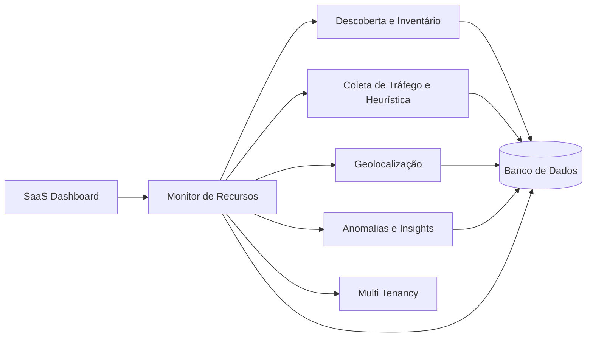

# Network Monitoring SaaS

Sistema SaaS para monitoramento inteligente de redes, com descoberta automática
de dispositivos, coleta de métricas, análise de tráfego, geolocalização,
detecção de anomalias e visualização operacional em dashboard.

O produto foi pensado para transformar dados brutos de rede em informações
acionáveis para equipes técnicas, clientes corporativos, provedores e ambientes
que precisam acompanhar disponibilidade, consumo, comportamento e risco em tempo
quase real.

---

## Visão Geral

O sistema opera em um ciclo contínuo:

```text
descobrir -> coletar -> analisar -> enriquecer -> alertar -> visualizar -> repetir
```

Esse fluxo mantém o inventário atualizado, acompanha a saúde da rede, identifica
mudanças de comportamento e entrega ao usuário uma visão consolidada dos ativos,
tráfego, alertas e indicadores operacionais.

---

## Objetivo

Fornecer visibilidade clara e contínua da rede, ajudando a responder perguntas
como:

- Quais dispositivos estão conectados à rede?
- Quem consome mais banda?
- Para onde o tráfego está indo?
- Existem picos, perdas, latência elevada ou comportamento suspeito?
- A rede está saudável para o nível de serviço esperado?
- Quais eventos precisam de ação imediata?

---

## Arquitetura em Alto Nível

O SaaS é organizado em serviços especializados coordenados por um componente
central de monitoramento. O dashboard não acessa diretamente o banco de dados nem
os serviços internos; ele se comunica com o Monitor de Recursos, que orquestra o
fluxo da requisição e consolida as respostas.



Para mais detalhes, consulte a
[Arquitetura de Requisição](./architecture/arquitetura-requisicao.md).

---

## Componentes Principais

### SaaS Dashboard

Interface utilizada pelo cliente para consultar dados, acompanhar indicadores,
visualizar alertas, navegar pelo inventário e gerar relatórios.

Responsabilidades:

- autenticação, autorização e controle de sessão;
- visualização de dispositivos e inventário;
- gráficos de banda, tráfego, latência e perda de pacotes;
- mapas e eventos de geolocalização;
- alertas, anomalias, insights e relatórios;
- filtros operacionais por tenant, período, dispositivo e severidade.

### Monitor de Recursos

Motor central da aplicação. Recebe as requisições do dashboard, coordena os
serviços internos e consolida respostas para visualização.

Responsabilidades:

- orquestrar descoberta, coleta, geolocalização e análise;
- aplicar contexto de tenant nas operações;
- controlar reprocessamentos quando uma resposta esperada não for obtida;
- consolidar dados operacionais para o dashboard;
- suportar alto volume de chamadas em um contexto SaaS.

### Descoberta e Inventário

Serviço responsável por identificar dispositivos e manter o inventário de rede
atualizado.

Responsabilidades:

- descobrir dispositivos ativos;
- identificar IP, MAC e hostname;
- detectar tipo, fabricante e sistema operacional quando possível;
- mapear portas, serviços e protocolos;
- associar dispositivos ao tenant correto.

### Coleta de Tráfego e Heurística

Serviço responsável por coletar métricas de tráfego e aplicar regras de análise
sobre o comportamento da rede.

Responsabilidades:

- medir download e upload;
- monitorar pacotes por segundo;
- calcular latência e perda de pacotes;
- identificar fluxos ativos;
- detectar picos, outliers e padrões relevantes.

### Geolocalização

Serviço responsável por enriquecer eventos de rede com contexto geográfico.

Responsabilidades:

- resolver localização por IP;
- classificar origem, destino, região e país quando disponível;
- apoiar mapas, relatórios e análise de tráfego externo.

### Anomalias e Insights

Serviço de inteligência responsável por detectar padrões, comportamentos
incomuns e eventos que merecem atenção.

Responsabilidades:

- aprender comportamento histórico da rede;
- identificar anomalias e outliers;
- classificar eventos suspeitos;
- gerar insights e previsões operacionais.

### Multi Tenancy

Camada lógica que garante separação de dados, permissões e recursos entre
clientes.

Responsabilidades:

- isolar dados por tenant;
- associar inventário, tráfego, alertas e relatórios ao cliente correto;
- apoiar limites por plano, permissões e governança de uso.

---

## Funcionalidades Principais

- Descoberta automática de dispositivos.
- Inventário visual de ativos de rede.
- Monitoramento de tráfego em tempo quase real.
- Análise heurística e detecção de anomalias.
- Geolocalização de origem e destino do tráfego.
- Dashboard com métricas, gráficos e mapas.
- Sistema de alertas e insights.
- Relatórios operacionais.
- Controle de acesso e isolamento por cliente.

---

## Fluxo de Funcionamento

1. O cliente acessa o SaaS Dashboard.
2. O dashboard envia uma requisição ao Monitor de Recursos.
3. O Monitor de Recursos aciona os serviços necessários.
4. Os serviços coletam, processam, enriquecem e persistem os dados.
5. O mecanismo de reprocessamento pode reenviar operações dentro de um limite de
   tentativas.
6. O resultado consolidado retorna ao dashboard.
7. O ciclo se repete continuamente para manter a visão da rede atualizada.

---

## Métricas Monitoradas

- Banda consumida em download e upload.
- Latência.
- Perda de pacotes.
- Pacotes por segundo.
- Uptime.
- Uso de CPU e memória, quando disponível.
- Fluxos ativos.
- Destinos e regiões de tráfego.
- Eventos suspeitos e anomalias.

---

## Casos de Uso

- Monitoramento de redes corporativas.
- Provedores de internet e operações de suporte.
- Ambientes industriais e IoT.
- Segurança e auditoria de rede.
- Diagnóstico de performance.
- Acompanhamento de SLA e saúde operacional.

---

## Decisões Arquiteturais

- [ADR 001: Microserviços](./adrs/adr-001-microserviço.md)
- [ADR 002: Frontend com Angular](./adrs/adr-002-angular-frontend.md)
- [ADR 003: Frontend com Atomic Design](./adrs/adr-003-atomic-design.md)

---

## Documentação Relacionada

- [Microsserviços](./SERVICES.md)
- [Arquitetura de Requisição](./architecture/arquitetura-requisicao.md)

---

## Roadmap

Consulte o [Roadmap consolidado](./ROADMAP.md).
