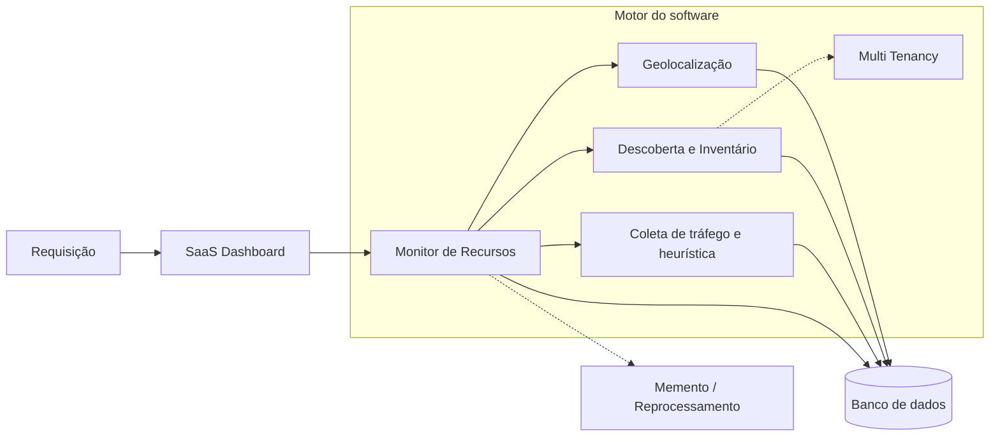

# Arquitetura de Requisição

**Projeto:** SaaS de Monitoramento de Rede
**Fonte visual:** [`../Requisição.png`](../Requisição.png)

---

## Visão Geral

Esta arquitetura descreve o fluxo de uma requisição no **SaaS de Monitoramento
de Rede**.
O **SaaS Dashboard** envia requisições para o **Monitor de Recursos**, que atua
como motor principal do software e coordena os serviços internos de
monitoramento, descoberta, inventário, geolocalização, coleta de tráfego e
heurística.

O desenho também considera persistência em banco de dados, suporte a
multi-tenancy e reenvio de requisições quando a resposta esperada não é obtida.

---

## Diagrama

---

## Componentes

### SaaS Dashboard

Interface utilizada pelo cliente para iniciar consultas e visualizar os dados de
monitoramento de rede. O dashboard envia requisições ao motor do software, mas
não acessa diretamente os demais serviços internos.

### Monitor de Recursos

Componente central da arquitetura. Recebe as requisições vindas do dashboard e
coordena chamadas para os serviços internos.

Responsabilidades:

- orquestrar o fluxo da requisição;
- acionar descoberta e inventário;
- acionar coleta de tráfego e heurística;
- acionar geolocalização;
- consolidar respostas para o dashboard;
- lidar com tentativas de reprocessamento quando necessário.

### Geolocalização

Serviço responsável por enriquecer os dados de rede com informações de
localização por IP, origem, destino e região.

### Descoberta e Inventário

Serviço responsável por identificar dispositivos, manter o inventário atualizado
e associar recursos ao contexto correto do cliente.

### Coleta de Tráfego e Heurística

Serviço responsável por coletar métricas de tráfego e aplicar regras
heurísticas sobre o comportamento da rede.

Exemplos de dados tratados:

- download e upload;
- pacotes por segundo;
- latência;
- perda de pacotes;
- fluxos ativos;
- comportamento bruto da rede.

### Banco de Dados

Camada de persistência consumida pelos serviços internos. Todos os serviços,
exceto o dashboard, podem realizar requisições ao banco para gravar ou consultar
informações necessárias ao processamento.

### Multi Tenancy

Camada lógica que garante separação de dados por cliente/tenant. A descoberta,
o inventário e os demais dados operacionais devem estar associados ao tenant
correto.

### Memento / Reprocessamento

Mecanismo previsto para reenviar ou reprocessar uma requisição quando a resposta
esperada não for obtida. A quantidade de tentativas deve ser controlada para
evitar ciclos infinitos.

---

## Fluxo da Requisição

1. O cliente interage com o **SaaS Dashboard**.
2. O dashboard envia uma **requisição** ao **Monitor de Recursos**.
3. O Monitor de Recursos coordena os serviços necessários.
4. Os serviços internos processam dados e consultam/persistem informações no
   banco de dados.
5. Caso a resposta esperada não seja obtida, o mecanismo de
   **Memento/Reprocessamento** pode reenviar a operação dentro do limite de
   tentativas.
6. O resultado consolidado retorna ao dashboard para visualização pelo cliente.

---

## Regras Arquiteturais

- O dashboard deve se comunicar com o sistema por meio do Monitor de Recursos.
- Serviços internos podem acessar o banco de dados.
- O dashboard não deve acessar diretamente o banco de dados.
- O contexto de tenant deve acompanhar operações relacionadas a dispositivos,
  inventário, tráfego, geolocalização, alertas e relatórios.
- Reprocessamentos devem ter limite explícito de tentativas.
- O Monitor de Recursos deve suportar alto volume de requisições, considerando
  milhares de chamadas conforme a demanda do SaaS.

---

## Relacionamentos

- Relacionado a: [`../README.md`](../README.md)
- Relacionado a: [`../adrs/adr-001-microserviço.md`](../adrs/adr-001-microserviço.md)
- Relacionado a: [`../adrs/adr-002-angular-frontend.md`](../adrs/adr-002-angular-frontend.md)
